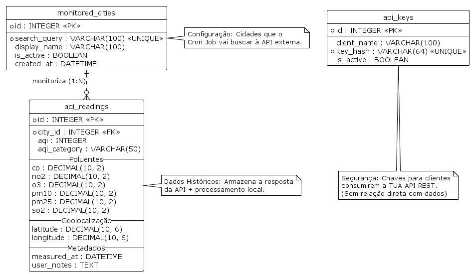

# Documento de Desenho e Arquitetura
**Projeto:** Sistema de Monitorização e Histórico de Qualidade do Ar (AQI)  
**Data:** 30/11/2025

## 1. Visão Geral da Arquitetura

O sistema adota uma arquitetura de **Microsserviços** (implementada como um serviço modular em Node.js), funcionando como uma camada intermédia entre o fornecedor de dados público (JuheAPI) e os clientes finais. O objetivo é garantir a persistência histórica, o processamento de dados e o controlo de acesso.

### Componentes Principais:
1. **Fonte de Dados Externa (JuheAPI):** Fornece dados em tempo real sobre a qualidade do ar.
2. **Serviço Backend (Node.js):**
   * **Scheduler (Cron):** Responsável pela sincronização periódica.
   * **Controller/Service:** Lógica de negócio, validação e orquestração.
   * **API REST:** Interface para consumo externo.
3. **Armazenamento (SQLite):** Base de dados relacional local.

---

## 2. Processos de Fluxo de Dados

### 2.1. Fluxo de Sincronização (Ingestão de Dados)
Este processo é automático e garante que a base de dados local mantém um histórico contínuo.

1. **Gatilho (Scheduler):** O módulo `node-cron` executa uma tarefa a cada hora (ex: `0 * * * *`).
2. **Leitura de Configuração:** O sistema consulta a tabela local `monitored_cities` para obter os nomes das cidades a processar (campo `search_query`).
3. **Requisição Externa:**
   * Endpoint: `GET https://hub.juheapi.com/aqi/v1/city`
   * Parâmetros: `q={nome_cidade}` e `apikey={JUHE_API_KEY}`.
4. **Processamento e Mapeamento:**
   * O sistema recebe o objeto `data`.
   * **Filtragem:** Verifica se a resposta é válida.
   * **Achatamento (Flattening):** Extrai `lat` e `lon` do objeto `geo` para colunas individuais.
   * **Cálculo Local:** Gera o campo `aqi_category` com base no valor de `aqi` (ex: 0-50 = "Bom", >150 = "Insalubre").
5. **Persistência:** Insere um novo registo na tabela `aqi_readings` com todos os poluentes (`co`, `no2`, `o3`, `pm10`, `pm25`, `so2`).

---

### 2.2. Fluxo de Exposição (Consumo via API REST)

1. **Autenticação:** O cliente envia um pedido com o header `x-api-key`. O middleware valida a chave na tabela `api_keys`.
2. **Consulta (Read):** O endpoint (ex: `GET /readings/history`) aceita filtros de data.
3. **Manipulação (Update/Create):** O cliente pode anotar registos existentes (ex: adicionar observações sobre o clima local) ou inserir medições manuais.
4. **Resposta:** Os dados são retornados em formato JSON padronizado.

---

## 3. Modelo de Dados (SQLite)

O esquema de dados foi desenhado para armazenar todos os campos fornecidos pela API externa, mantendo a integridade relacional.

### 3.1. Tabela: `monitored_cities`
Armazena as configurações das cidades que o sistema deve vigiar.

```sql
CREATE TABLE monitored_cities (
    id INTEGER PRIMARY KEY AUTOINCREMENT,
    search_query VARCHAR(100) NOT NULL UNIQUE, -- O termo usado no param 'q' (ex: "london")
    display_name VARCHAR(100),                 -- Nome amigável (ex: "Londres - Sede")
    is_active BOOLEAN DEFAULT 1,               -- Controlo para o Scheduler
    created_at DATETIME DEFAULT CURRENT_TIMESTAMP
);
```

### 3.2. Tabela: `aqi_readings`
Armazena o histórico completo e os dados processados. O objeto `geo` da API é armazenado como colunas `latitude` e `longitude`.

```sql
CREATE TABLE aqi_readings (
    id INTEGER PRIMARY KEY AUTOINCREMENT,
    city_id INTEGER NOT NULL,
    
    -- Dados Principais
    aqi INTEGER,
    aqi_category VARCHAR(50),  -- Campo processado localmente (ex: "Moderado")
    
    -- Poluentes (Dados Brutos da API)
    co DECIMAL(10, 2),
    no2 DECIMAL(10, 2),
    oo DECIMAL(10, 2),
    pm10 DECIMAL(10, 2),
    pm25 DECIMAL(10, 2),
    so2 DECIMAL(10, 2),
    
    -- Geolocalização (Do objeto 'geo')
    latitude DECIMAL(10, 6),
    longitude DECIMAL(10, 6),
    
    -- Metadados do Sistema
    measured_at DATETIME DEFAULT CURRENT_TIMESTAMP,
    user_notes TEXT,           -- Campo para operações de Update (CRUD)
    
    FOREIGN KEY(city_id) REFERENCES monitored_cities(id) ON DELETE CASCADE
);
```

### 3.3. Tabela: `api_keys`
Gere o acesso seguro à API REST local.

```sql
CREATE TABLE api_keys (
    id INTEGER PRIMARY KEY AUTOINCREMENT,
    client_name VARCHAR(100),
    key_hash VARCHAR(64) NOT NULL UNIQUE, -- Hash da chave para segurança
    is_active BOOLEAN DEFAULT 1
);
```



---

## 4. Modelo de Segurança

O sistema implementa segurança em duas camadas:

### Segurança de Origem (Backend -> JuheAPI)
- A chave da API externa é armazenada em variáveis de ambiente (`.env`) e nunca exposta ao cliente final.

### Segurança de Exposição (Cliente -> Backend Local)
- **Autenticação:** Via API Key no header (`x-api-key`).  
- **Autorização:** Apenas clientes com chaves ativas podem executar `POST`, `PATCH` ou `DELETE`.  
- **Validação:** Sanitização de inputs para prevenir SQL Injection.

---

## 5. Interface da API REST (Especificação)

### 5.1. Endpoints de Configuração

#### `POST /cities`
Regista uma nova cidade para monitorização.  
Body:
```json
{ "search_query": "beijing", "display_name": "Pequim" }
```

#### `GET /cities`
Lista cidades monitorizadas.

---

### 5.2. Endpoints de Dados (CRUD Operacional)

#### READ: `GET /cities/:city_id/readings`
Query Params:
```
?limit=50&start_date=2025-01-01
```

Exemplo de resposta:
```json
{
    "id": 105,
    "city": "beijing",
    "aqi": 165,
    "classification": "Insalubre",
    "pollutants": {
        "co": 10, "no2": 32.5, "o3": 0.9,
        "pm10": 111, "pm25": 165, "so2": 2.1
    },
    "location": { "lat": 39.95, "lon": 116.46 },
    "notes": null,
    "timestamp": "2025-11-30T10:00:00Z"
}
```

#### CREATE: `POST /readings`
Uso: adicionar dados de um sensor local.  
Body: estrutura semelhante à tabela `aqi_readings`.

#### UPDATE: `PATCH /readings/:reading_id`
Uso: adicionar notas explicativas.  
Body:
```json
{ "user_notes": "Feriado nacional, tráfego reduzido." }
```

#### DELETE: `DELETE /readings/:reading_id`
Uso: remover leitura incorreta.
